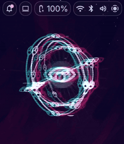
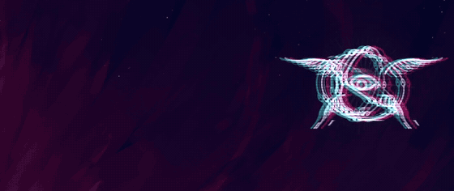
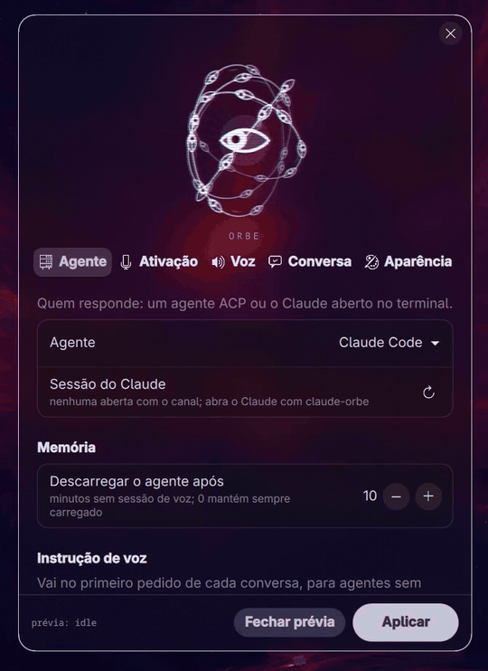
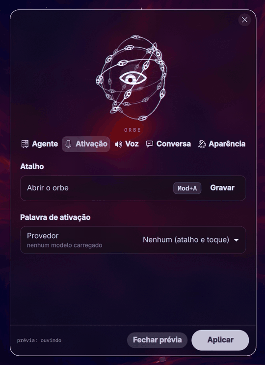
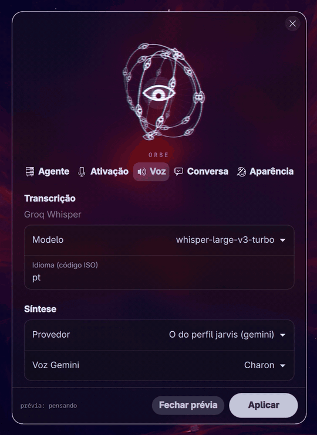
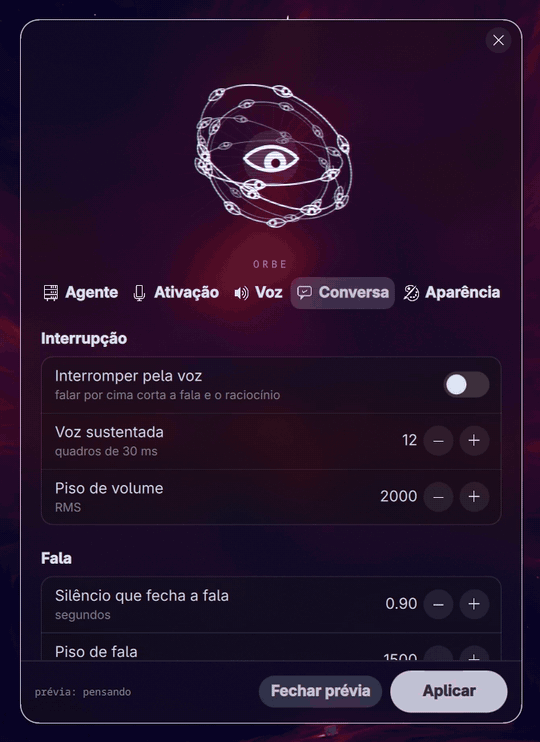
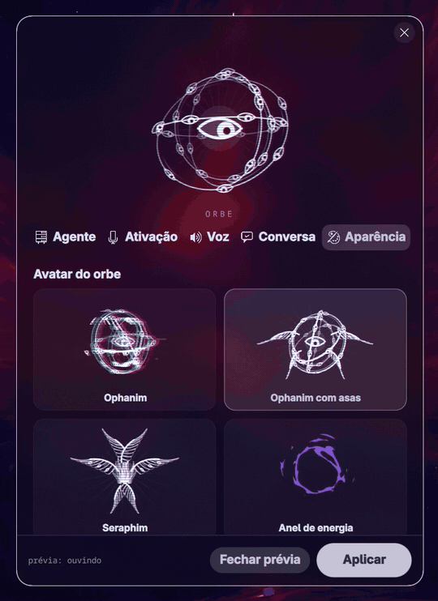

# Orbe

Assistente de voz para agentes de IA no Wayland. Você fala, o agente responde
em voz, e um orbe animado no canto da tela mostra o estado da conversa
(ouvindo, pensando, respondendo) e as linhas do raciocínio do agente.

Funciona com qualquer agente que fale ACP (Agent Client Protocol), como
Hermes Agent, OpenCode e Gemini CLI, e com o Claude Code por um canal MCP.

<table align="center">
<tr>
<td align="center"><br>Ophanim</td>
<td align="center"><br>Ophanim com asas</td>
</tr>
<tr>
<td align="center" colspan="2"><br>Anel de energia</td>
</tr>
</table>

Cada avatar passa por ouvindo, pensando (com as linhas do raciocínio ao lado)
e respondendo, gravado na área de trabalho.

## O que ele faz

- **Ativação** por atalho de teclado, toque no orbe ou palavra de ativação
  local (openWakeWord, sherpa-onnx com frase livre ou microWakeWord). O
  toque vale com o dedo, em telas touchscreen, e com o clique do cursor.
- **Transcrição** pelo Groq Whisper; **síntese** por Gemini, xAI ou Piper
  (local).
- **Conversa por voz**: falar por cima interrompe (opcional), "tchau"
  dispensa o orbe, "fica" trava a sessão aberta e "pode soltar" destrava.
  Dois toques (ou cliques) no orbe também travam.
- **Avatares desenhados na GPU**: Ophanim, Ophanim com asas e anel de
  energia, com glitch, sombra opcional e o texto do raciocínio ao lado ou
  abaixo do orbe.
- **App de configuração** com prévia ao vivo que passa por todos os estados.

<p align="center">





</p>

## Requisitos

- Linux com um compositor Wayland que tenha layer-shell. Testado no niri 26.04.
- [Quickshell](https://quickshell.org) 0.3 ou mais novo (comando `qs`), que
  desenha o orbe.
- PipeWire (`pw-record`, `wpctl`).
- PySide6 no Python do sistema, para o app.
- Python 3.11 ou 3.12 para o daemon (o worker de voz usa `audioop`, que saiu
  no 3.13) com `numpy scipy sounddevice webrtcvad requests onnxruntime
  websockets pyyaml`. Opcionais: `openwakeword` e `sherpa-onnx` (palavra de
  ativação) e `piper-tts` (voz local).
- Uma chave do [Groq](https://console.groq.com) para a transcrição.
- `qt6-shadertools`, só se for alterar os shaders (os `.qsb` já vêm
  compilados).

No Arch:

```sh
sudo pacman -S quickshell pyside6 pipewire uv
```

## Instalação

```sh
git clone https://github.com/bbarrosdavi/orbe.git ~/.local/share/orbe
cd ~/.local/share/orbe

# Python do daemon (pule se já usa o venv do Hermes Agent); o uv baixa o 3.12
uv venv --python 3.12 .venv
uv pip install --python .venv numpy scipy sounddevice webrtcvad requests onnxruntime websockets pyyaml

ORBE_PY="$PWD/.venv/bin/python" ./install.sh
```

O `install.sh` cria o serviço do usuário (`hermes-voice.service`), o atalho
"Orbe" no lançador de aplicativos e, se o Hermes estiver instalado, as skills
que deixam o agente segurar e dispensar a sessão. Sem `ORBE_PY`, ele usa o venv
do Hermes Agent, se existir, ou o `python3` do PATH.

Depois:

1. Ponha a chave do Groq em `~/.hermes/.env`:
   ```sh
   mkdir -p ~/.hermes && echo 'GROQ_API_KEY=gsk_...' >> ~/.hermes/.env
   ```
   Para síntese pelo Gemini, acrescente `GEMINI_API_KEY=...` no mesmo arquivo.
2. Abra o app **Orbe** e escolha o agente, a ativação e a voz. O botão
   "Pré-visualizar" mostra o orbe passando por todos os estados.
3. Ligue o serviço:
   ```sh
   systemctl --user enable --now hermes-voice
   ```

### Atalho de teclado

O atalho chama `orb_control.py toggle`. No niri, em qualquer arquivo de binds:

```kdl
Mod+A hotkey-overlay-title="Voice Assistant (Orb)" { spawn "/caminho/do/orbe/orb_control.py" "toggle"; }
```

O app troca a tecla desse bind se ele estiver em `~/.config/niri/dms/binds.kdl`.
Em outros compositores, ligue qualquer tecla a `orb_control.py toggle`.

### Claude Code

Abra o Claude com `./claude-orbe` no lugar de `claude` e escolha "Claude Code"
na aba Agente do app. O orbe passa a falar com aquela sessão.

### Cancelamento de eco (opcional)

Para interromper o agente falando por cima sem que ele ouça a própria voz:

```sh
mkdir -p ~/.config/pipewire/pipewire.conf.d
cp pipewire-hermes-aec.conf ~/.config/pipewire/pipewire.conf.d/99-hermes-echo-cancel.conf
systemctl --user restart pipewire
sed -e "s|@ORBE@|$PWD|g" hermes-aec.service.unit > ~/.config/systemd/user/hermes-aec.service
systemctl --user daemon-reload && systemctl --user enable --now hermes-aec
```

## Modelos locais

Todos opcionais; o daemon procura em `~/.hermes/`:

| Arquivo | Para quê |
|---|---|
| `cache/vad/silero_vad.onnx` | detector de voz Silero (sem ele, usa o webrtcvad) |
| `cache/wakewords/*.onnx`, `*.tflite`, `sherpa-onnx-kws-*` | palavra de ativação; caminhos editáveis no app |
| `piper_models/*.onnx` | voz local do Piper |
| `mww-tf/.venv` | venv com `tensorflow` para o microWakeWord |

`record_and_train_wake.py` e `train_ei_hermes.py` treinam uma palavra de
ativação própria a partir de gravações e de vozes do Piper.

## Controle pela linha de comando

```sh
./orb_control.py toggle    # abre ou fecha uma sessão de voz
./orb_control.py hold      # trava a sessão aberta
./orb_control.py release   # volta a fechar sozinha após o silêncio
./orb_control.py dismiss   # encerra e esconde o orbe
```

## Estrutura

| Arquivo | Papel |
|---|---|
| `hermes_voice_daemon.py` | captura, ativação, VAD, transcrição e orquestração |
| `hermes_voice_acp.py` | cliente ACP: fala com o agente escolhido |
| `hermes_voice_canal.py`, `claude-orbe` | canal MCP para o Claude Code |
| `hermes_voice_tts.py` | worker de síntese e reprodução |
| `orbe-qt/orbe.qml` | orbe em Quickshell (layer-shell), desenho em shaders |
| `orbe-qt/app/`, `hermes_voice_app.py` | app de configuração (PySide6 e QML) |
| `orb_control.py` | controle do orbe por socket |
| `hermes_voice_config.py` | config única em `~/.config/hermes-voice/config.json` |
| `skills/` | skills do Hermes para segurar e dispensar a sessão |
| `*.service.unit`, `orbe.desktop.in` | modelos preenchidos pelo `install.sh` |

Para testar os shaders sem abrir nada na tela, `orbe-qt/teste/render.py`
desenha qualquer cena de `orbe-qt/teste/` num PNG:

```sh
QT_QPA_PLATFORM=wayland python3 orbe-qt/teste/render.py orbe-qt/teste/vitrine.qml vitrine.png
```
